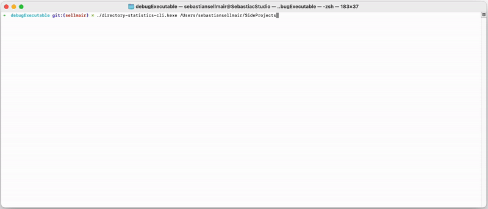

# **Ev**ents **a**nd **S**tates for Kotlin

<p>

</p>

# What is Evas?

Evas is a **library** providing

## `Events`
A performant, scalable and most importantly **scoped** Event-Channel integrated with coroutines (and compose), which
offers advantages like a traditional "Event Bus" (such as flexibility, decoupling, simplicity), whilst retaining
structured concurrency, clear scoping, and easy testing.

## `States`
A pragmatic state container, offering the accessibility and ease of use of a Singleton, whilst also retaining clearly
structured concurrency, scoping, and easy testing.

Discussions about architecture are fun, but at its core usually evolve around answering the following questions

1. Where does my 'State' live? -> `States`
2. How to pass 'Events' around? -> `Events`
3. How are Events and States connected? -> `kotlinx.coroutines`

___ 

✅ Multiplatform (jvm, android, iOS, watchOS, macOS, linux, windows, wasm, js, ...)<br>
✅ Fast / Performance benchmarked (kotlinx.benchmark)<br>
✅ Concurrency tested (kotlinx.lincheck)<br>
✅ API stability tested (kotlinx.binary-compatibility-validator)<br>
✅ Tiny Binary Size (~ 90kb)<br>
➕ Compose Extensions<br>
➕ Inline documentation with 'usage examples'<br>

---

## Dependencies

```kotlin
implementation("io.sellmair:evas:1.0.0-beta02")
```

(Compose Extensions)

```kotlin
implementation("io.sellmair:evas-compose:1.0.0-beta02")
```


---

# Simple Usage

## Setup

Instances of the `Events` (Event Bus) and `States`(State Container) can simply be created using the
`Events()` and `States()` factory functions.

### Coroutines Context

Binding them to the current coroutine context is as simple as

[snippet]: (setup-coroutines.kt)
```kotlin
val events = Events() // <- create new instance
val states = States() // <- create new instance
withContext(events + states) {

}
```

### Compose Extensions

Binding the event bus or state container to compose is as simple as

[snippet]: (setup-compose.kt)
```kotlin
val events = Events() // <- create new instance
val states = States() // <- create new instance

@Composable
fun App() {
    installEvas(events, states) {
        MainPage()
    }
}
```

## Send and Subscribe to Events

The following snippet shows how two Events are processed:

1) `LoginEvent`: Will be fired once a user successfully logged into our application
2) `LogoutEvent`: Will be fired once a user intends to log out

Once the `Events` instance is installed in the current 'Coroutine Context', listening for them
can be done usinge the `collectEvents` method.

Firing an event can simply be done by calling `emit`:
Note: The `emit()` function will suspend until all listening coroutines finished processing.
(See `emitAsync()` to dispatch events without waiting for all listeners.

[snippet]: (loginEvents.kt)
```kotlin
object LogoutEvent: Event

data class LoginEvent(val userName: String, val token: String): Event

/**
 * Use 'collectEvents' to subscribe to all events of type [LogoutEvent]
 */
suspend fun listenForLogout() = collectEvents<LogoutEvent> {
    println("User logged out")
}

/**
 * Use 'collectEvents' to subscribe to all events of type [LoginEvent]
 */
suspend fun listenForLogin() = collectEvents<LoginEvent> { event ->
    println("User: ${event.userName} logged in")
}

/**
 * Example function 'login' which will pretend to login a user and then
 * emits a [LoginEvent]
 */
suspend fun login(userName: String, password: String) {
    val token = httpClient().login(userName, password) ?: return
    LoginEvent(userName, token).emit()
                    //          ^
                    // emit the event and suspend until
                    // All listeners have finished processing this event
}

/**
 * Example function 'logout' which will pretend to delete user data and then
 * emits a [LogoutEvent]
 */
suspend fun logout() {
    deleteUserData()
    LogoutEvent.emit()
    //          ^
    // emit the event and suspend until
    // All listeners have finished processing this event
}
```

## Simple State

Defining a simple State counting the number of 'clicks' performed by a user

[snippet]: (simpleClickCounterState.kt)
```kotlin
/**
 * Pretend: Our application cares about the number of 'clicks' the user has performed.
 * We define our [ClickCounterState] here which holds this information.
 */
data class ClickCounterState(val count: Int) : State {
    /*
    Using the 'companion object' as Key, defining '0' as the default state
     */
    companion object Key : State.Key<ClickCounterState> {
        override val default: ClickCounterState = ClickCounterState(count = 0)
    }
}

/**
 * Launching the coroutine, which will produce the [ClickCounterState].
 * It will collect the [ClickEvent]s and update the [ClickCounterState] by incrementing for each click it receives.
 */
fun CoroutineScope.launchClickCounterState() = launchState(ClickCounterState) {
    var count = 0
    collectEvents<ClickEvent> {
        count++
        ClickCounterState(count).emit()
        //                        ^
        //                 Emit State Update
    }
}

/**
 * Imaginary 'onClick' method which will send the [ClickEvent] to the application
 */
suspend fun onClick() {
    ClickEvent.emit()
    //          ^
    // emit event and wait for all listening coroutines to finish
}
```

Using this state and print updates to the console
[snippet]: (usingClickCounterState.kt)
```kotlin
fun CoroutineScope.launchClickCounterPrinter() = launch {
    ClickCounterState.collect { state ->
        println("Click Count: ${state.count}")
    }
}
```

## Launch State Producer & Show Compose UI

### Define a 'hot' state and 'hot' state producer
In this example we're going to model the 'Login State' of a user which can be
a) Logged Out
b) Currently Logging In
c) Logged In

For this the State can be modeled using a sealed class.

The state will be produced by a 'launchState' coroutine, which will try to find the user data
from a local database and handles login requests (sent as events)

[snippet]: (hotUserLoginState.kt)
 ```kotlin

/**
 * Defining an imaginary [UserLoginState] which knows about if the User is currently logged into our
 * application (or currently attempting to)
 *
 * In this example 'null' is chosen as the default state, representing that it is "unknown"
 */
sealed class UserLoginState : State {
    companion object Key : State.Key<UserLoginState?> {
        override val default: UserLoginState? = null
    }

    data object LoggedOut : UserLoginState()
    data object LoggingIn : UserLoginState()
    data class LoggedIn(val userId: UserId) : UserLoginState()
}

/**
 * Launching the [UserLoginState] producing coroutine:
 * This coroutine will:
 * - Try to find the currently logged-in user data from a local database
 * - Handle [LoginRequest] events and tries to log a user in, if received
 */
fun CoroutineScope.launchUserLoginState() = launchState(UserLoginState) {
    val user = getUserFromDatabase()
    if (user != null) {
        LoggedIn(user.userId).emit()
        return@launchState
    }

    /**
     * Oh, oh: User wasn't found in the local database:
     * We're setting the state to [LoggedOut]
     */
    LoggedOut.emit()

    /**
     * From here on, we collect all [LoginRequest] events and try to log the user in, by hitting
     * the network.
     */
    collectEvents<LoginRequest> { request ->
        LoggingIn.emit()

        val response = sendLoginRequestToServer(request.user, request.password)
        if (response.isSuccess) {
            LoggedIn(response.userId).emit()
        } else {
            LoggedOut.emit()
        }
    }
}
 ```

### Use State in UI development (e.g., compose, using `io.sellmair:evas-compose`)

[snippet]: (composeValue.kt)
 ```kotlin
@Composable
fun App() {
    val loginState = UserLoginState.composeValue()
    //                                   ^
    //         Will trigger re-composition if the state changes

    when (loginState) {
        is LoggedOut -> ShowLoginScreen()
        is LoggingIn -> ShowLoginSpinner()
        is LoggedIn -> ShowMainScreen()
        null -> Unit
    }
}
 ```

___

# Sample Projects

## Login Screen App (iOS, Android, Desktop App)

- [Entry Point: Android](samples/login-screen/src/androidMain/kotlin/io/sellmair/sample/MainActivity.kt)
- [Entry Point: iOS]()

## Joke App (iOS, Android, Desktop App)

- [Entry Point: Android](samples/joke-app/src/androidMain/kotlin/io/sellmair/jokes/MainActivity.kt)
- [Entry Point: iOS](samples/login-screen/src/iosMain/kotlin/io/sellmair/sample/SampleAppViewController.kt)
- [Entry Point: Desktop](samples/login-screen/src/jvmMain/kotlin/io/sellmair/sample/SampleApplication.kt)
- [Login Screen: Compose UI](samples/login-screen/src/commonMain/kotlin/io/sellmair/sample/ui/LoginScreen.kt)

## CLI Application (Directory Scanner)



- [Entry Point: Main.kt](https://github.com/sellmair/evas/blob/895fcb39528ff008bcbbe5959b3f79298caabbdc/samples/directory-statistics-cli/src/nativeMain/kotlin/Main.kt)
- [SummaryState](samples/directory-statistics-cli/src/nativeMain/kotlin/SummaryState.kt)
- [Command Line UI](samples/directory-statistics-cli/src/nativeMain/kotlin/uiActor.kt)